= Übungsblatt 4 - Softwareentwicklung I
:icons: font
Prof. Dr. Ullrich Hafner <ullrich.hafner@hm.edu>
:toc-title: Inhaltsverzeichnis
:chapter-label:
:chapter-refsig: Kapitel
:section-label: Abschnitt
:section-refsig: Abschnitt

:xrefstyle: short
:!sectnums:
:partnums:
ifndef::includedir[:includedir: ./]
ifndef::imagesdir[:imagesdir: ./]
ifndef::plantUMLDir[:plantUMLDir: .plantuml/]
:figure-caption: Abbildung
:table-caption: Tabelle

ifdef::env-github[]
:tip-caption: :bulb:
:note-caption: :information_source:
:important-caption: :heavy_exclamation_mark:
:caution-caption: :fire:
:warning-caption: :warning:
endif::[]

[TIP]
====

Die Abgabe dieses Übungsblattes ist möglich bis zum 4.12. 23:00. Laden Sie Ihre Lösung im https://classroom.github.com/a/h0PY-vDW[GitHub Classroom Kara 4] Projekt auf den eigenen `main` Branch hoch. Im Praktikum zeigen wir Ihnen, wie Sie dies am einfachsten umsetzen.

====

[hinweise]
== Allgemeine Hinweise bzw. Tipps

[TIP]
====

Beachten Sie wieder, dass in allen Aufgaben beliebige Welten (gemäß der Aufgabenstellung) zulässig sind. D.h. eine Aufgabe ist nur teilweise gelöst, wenn Ihr Programm nur für einige der abgebildeten Varianten funktioniert.

Bisher war die Verwendung von komplexeren Java Konstrukten (die noch in späteren Vorlesungen vorgestellt werden) nicht verboten. Dies wird für diese Aufgaben etwas modifiziert: Instanzvariablen oder Container sind in diesem Blatt **nicht erlaubt**. Nur lokale Variablen (und ggf. Methodenparameter) sind zur Speicherung von Werten und Arrays erlaubt. Im Zweifelsfall fragen Sie bitte bei mir oder den Tutoren nach, ob Ihre Lösungsvariante erlaubt ist.

Und noch ein letzter Tipp: in vielen Aufgaben benötigen Sie die Breite oder Höhe der Welt als Zahl. Diese können Sie selbst algorithmisch mit den in der Vorlesung vorgestellten Sprachmitteln ermitteln.

====

== 13. Spieglein, Spieglein an der Wand – Volume 2

Schreiben Sie ein weiteres Programm für Kara, das ein beliebiges vorgegebenes Muster spiegelt. Diesmal geht es darum Muster aus Blättern zu spiegeln. Dies ist schwieriger als in Aufgabe 9, da nicht nur ein Blatt pro Zeile bzw. Spalte vorkommen kann, sondern beliebig viele.

Die Ausgangswelt ist nach folgendem Muster aufgebaut:

- Die Welt hat eine ungerade Anzahl an Zeilen (Höhe: _h_ = 2 _n_ + 1  mit _n_ ≥ 1),
in der Mitte (Zeile _n_) befindet sich die Spiegelachse als Spur aus Bäumen.
- Über der Spiegelachse befindet sich ein festes Muster aus Blättern, die Fläche oberhalb der Bäume kann aber diesmal
beliebig gefüllt sein (oder auch komplett leer bleiben).
- Die Breite der Welt ist beliebig.

Kara startet dabei links oben in der Ecke mit Blick nach rechts. Nach dem Ende des Programms soll Kara wieder in der Ausgangsposition stehen.

.Ausgangssituation 1 (links) und erwartetes Ergebnis (rechts)
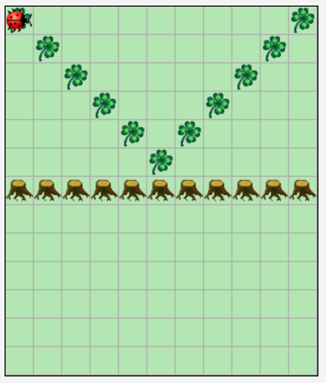
image:images/right-arrow.png[width=10%, pdfwidth=10%]
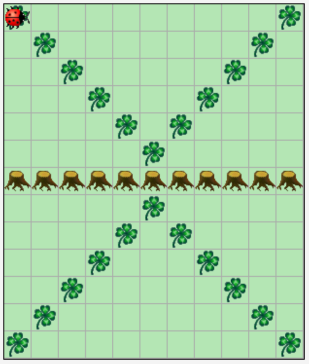

.Ausgangssituation 2 (links) und erwartetes Ergebnis (rechts)
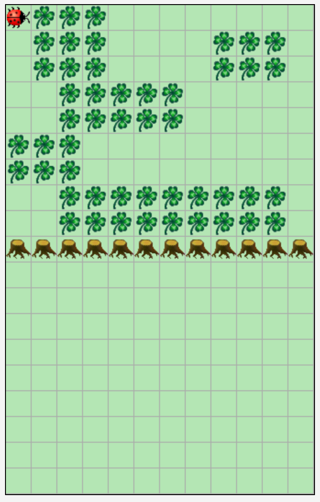
image:images/right-arrow.png[width=10%, pdfwidth=10%]
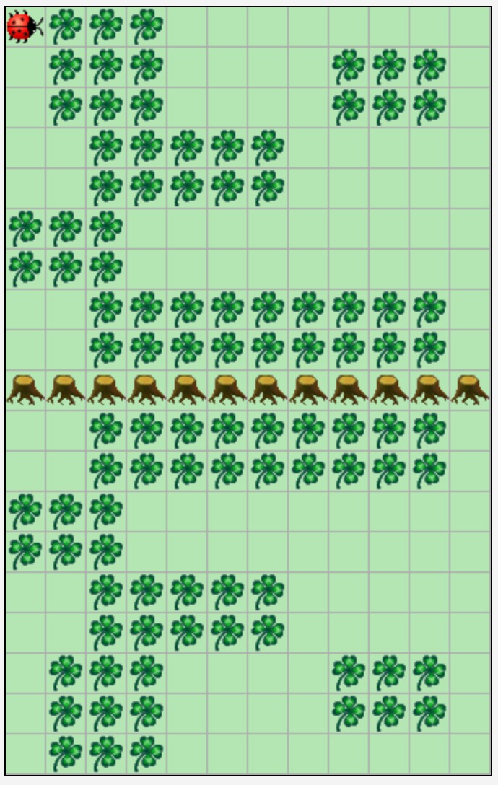

[TIP]
====

Nutzen Sie ein `boolean` Array um die Blätter einer Spalte (oder Zeile) zu speichern, damit können Sie
die gegenüberliegende Seite dann ohne größere Umwege befüllen.

====

== 14. Primzahlensuche visualisieren mit dem Sieb des Eratosthenes

Kara hat nun Lust auf Mathematik! Sie möchte Primzahlen in Ihrer Welt finden. Zur Erinnerung:
Eine Primzahl ist eine ganze Zahl, die nur durch 1 und sich selbst teilbar ist (und größer als die 1 ist).

Die Welt ist diesmal 10 Felder breit und beliebig hoch und komplett mit Blättern gefüllt.
Kara steht wie immer links oben mit Blick nach rechts und soll dort auch wieder die Aufgabe beenden.
Jedes Feld entspricht einer Zahl. Links oben steht die 1, dann die 2 bis zur 10 in der ersten Zeile.
Dann kommt die 11 ganz links in Zeile 2 bis zur 20 in derselben Zeile. Und so fort, bis das Ende der Welt erreicht ist.
Am Ende soll die Welt so mit Blättern gefüllt sein, dass jedes Feld, das eine Primzahl
repräsentiert, mit einem Blatt gefüllt ist, wie nachfolgend durch die grüne Farbe symbolisiert.

[cols="^1,^1,^1,^1,^1,^1,^1,^1,^1,^1"]
|===

|1|{set:cellbgcolor:#4AD386}2|3|{set:cellbgcolor:!}4|{set:cellbgcolor:#4AD386}5|{set:cellbgcolor:!}6|{set:cellbgcolor:#4AD386}7|{set:cellbgcolor:!}8|9|10
|{set:cellbgcolor:#4AD386}11|{set:cellbgcolor:!}12|{set:cellbgcolor:#4AD386}13|{set:cellbgcolor:!}14|15|16|{set:cellbgcolor:#4AD386}17|{set:cellbgcolor:!}18|{set:cellbgcolor:#4AD386}19|{set:cellbgcolor:!}20

|===

Schreiben Sie ein Programm, das diese Aufgabe mit dem Algorithmus „Sieb des Eratosthenes“ löst. Kara soll dabei
die Welt entsprechend ablaufen, und die Blätter so lange entfernen, bis nur die Primzahlen
übrigbleiben. Der Algorithmus ist nachfolgend in Kurzform beschrieben:

Zuerst werden alle Zahlen 1, 2, 3, 4, … n der Reihe nach auf die Felder von Karas Welt verteilt, wie oben beschrieben.
Alle Zahlen sind zunächst mögliche Primzahlen.
Der Algorithmus nimmt sich nun jeweils die kleinste noch nicht gestrichene Zahl (größer 1), und markiert diese als
Primzahl. Im ersten Schritt ist dies die 2. Nachdem jeweils eine Primzahl gefunden wurde, werden alle Vielfachen dieser
Primzahl gestrichen, denn diese sind sicher keine Primzahlen, da sie ja durch die gefundene Primzahl teilbar sind.
D.h. im ersten Schritt werden dann die Vielfachen der 2, also die 4, 6, 8, etc. gestrichen.
Danach wird wieder von vorne gestartet und die kleinste nächste nicht gestrichene Zahl als Primzahl markiert.
Im zweiten Schritt ist das die 3. Gestrichen werden dann die Zahlen 6, 9, 12, 15, etc.
Sobald das Quadrat der Primzahl größer als die maximal mögliche Zahl _n_ ist, sind alle Primzahlen kleiner oder gleich
_n_ bestimmt: Es sind genau die nicht gestrichenen Zahlen.

Starten Sie eine Internet-Recherche, wenn Ihnen der Algorithmus noch nicht klar ist: Lesen Sie sich in weitere
Beschreibungen ein, um diese Aufgabe zu lösen.

Zur Verdeutlichung des Algorithmus habe ich Ihnen ein kleines Video meiner Lösung in Moodle hochgeladen.

[TIP]
====

Auch wenn im Internet die meisten Beschreibungen dieses Algorithmus ein Array benutzen: wir benötigen das nicht, es lässt sich
bei uns schöner visualisieren, indem wir direkt in die Welt von Kara schreiben.

====

.Ausgangssituation 1 (links) und erwartetes Ergebnis (rechts)
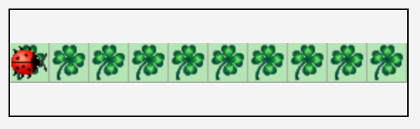
image:images/right-arrow.png[width=10%, pdfwidth=10%]
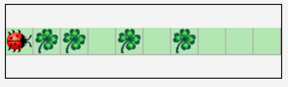

.Ausgangssituation 2 (links) und erwartetes Ergebnis (rechts)
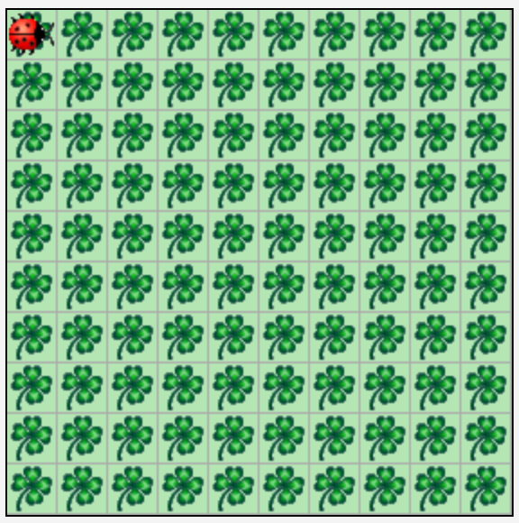
image:images/right-arrow.png[width=10%, pdfwidth=10%]
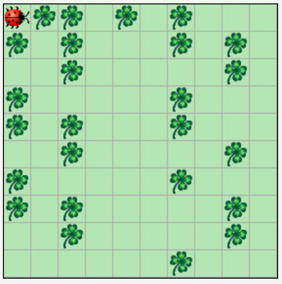

== 15. Duplikate Checker

Duplikate zu finden, ist eine große Herausforderung unserer Zeit. Auch Kara will da mithalten und untersucht Ihre Welt
auf doppelte Elemente. Dazu ist eine feste Welt von 12x10 gegeben (10 Zeilen a 10 Spalten mit dem Blattmuster und 2
extra Spalten zum Markieren): Kara möchte in dieser Welt doppelte Zeilen finden,
die dasselbe Blattmuster haben. Diese doppelten Zeilen sollen anschließend markiert werden, indem der Pilz am Ende der
Zeile nach rechts verschoben wird. Gibt es keine doppelten Zeilen, dann wird auch kein Pilz verschoben.
Sie können davon ausgehen, dass nicht mehrere verschiedene doppelte Elemente auftreten: entweder keine doppelten
oder genau ein Paar Zeilen, das doppelt ist.

[TIP]
====

Auch hier sind Arrays zum Vergleich der Zeilen sehr hilfreich.

====

.Ausgangssituation 1 (links) und erwartetes Ergebnis (rechts)
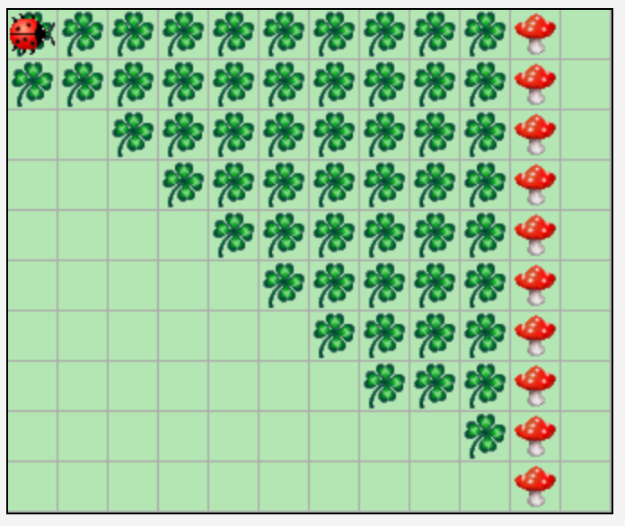
image:images/right-arrow.png[width=10%, pdfwidth=10%]
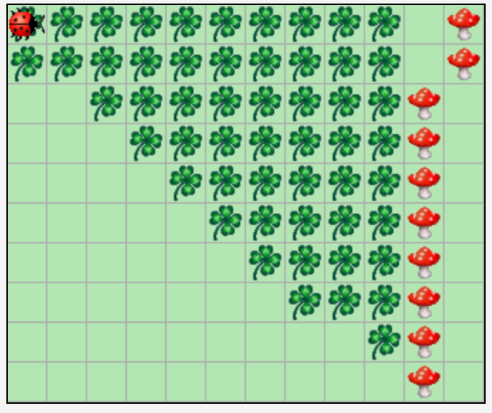

.Ausgangssituation 2 (links) und erwartetes Ergebnis (rechts)
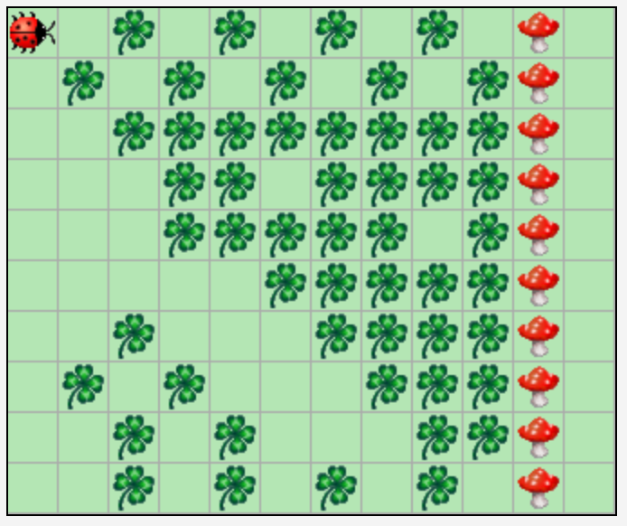
image:images/right-arrow.png[width=10%, pdfwidth=10%]
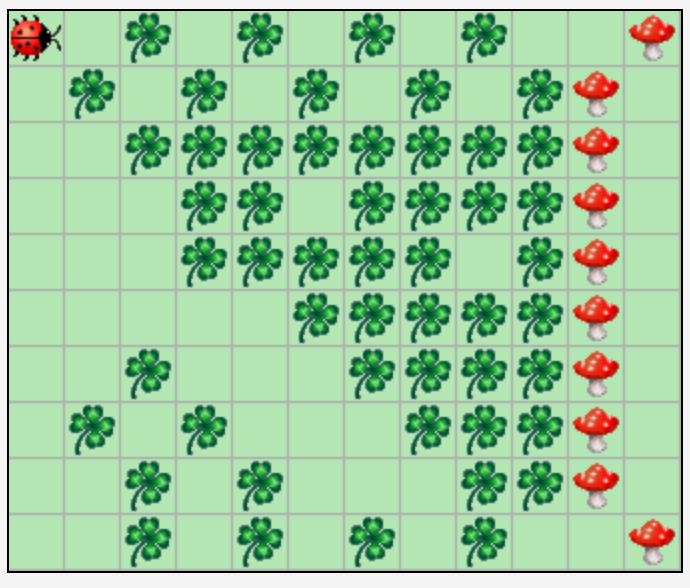

.Ausgangssituation 3 und gleichzeitig erwartetes Ergebnis
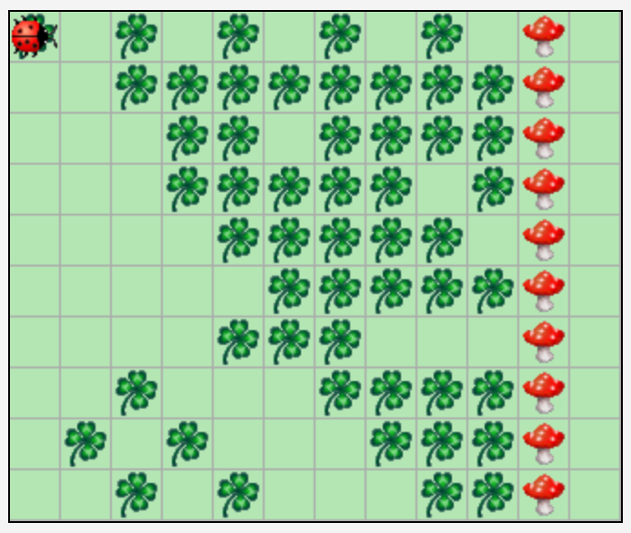

== 16. Schiebung

Schreiben Sie ein Programm, das die Blätter in Karas Welt um die angegebene Anzahl _n_ an Spalten horizontal verschiebt
(_n_ ist eine beliebig große Integer Zahl). Die Welt von Kara ist beliebig groß und enthält ein beliebiges Muster aus
Blättern. Der komplette Rand der Welt ist mit Bäumen eingefasst.
Kara startet in der linken oberen Ecke (innerhalb der Baumbegrenzung) mit Blick nach rechts.
Nach dem Ende des Programms soll Kara wieder in der Ausgangsposition stehen.
Die Welt soll dabei so verschoben werden, dass Spalten, die links bzw. rechts herausgeschoben werden, auf der
gegenüberliegenden Seite wieder hineingeschoben werden. Bei positiven Zahlen wird die Welt nach links verschoben,
bei negativen Zahlen nach rechts. Die Anzahl der Spalten um die verschoben wird, können Sie mit folgendem Aufruf
am Anfang Ihrer act Methode ermitteln:

[source,java]
----
int shift = askNumber("Um wieviel horizontal verschieben?");
----

.Ausgangssituation 1 (links) und erwartetes Ergebnis nach Shift 4 (mitte) und erwartetes Ergebnis nach erneutem Shift -6 (rechts)
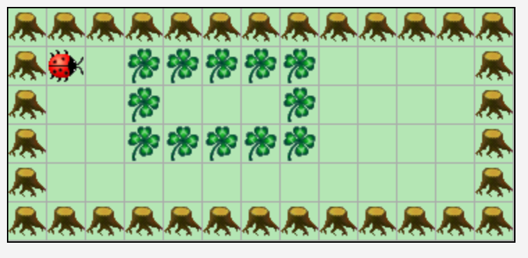
image:images/right-arrow.png[width=3%, pdfwidth=3%]
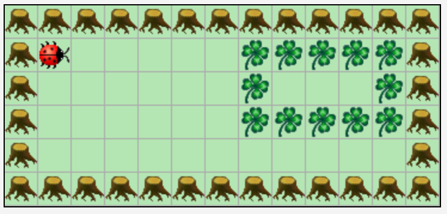
image:images/right-arrow.png[width=3%, pdfwidth=3%]
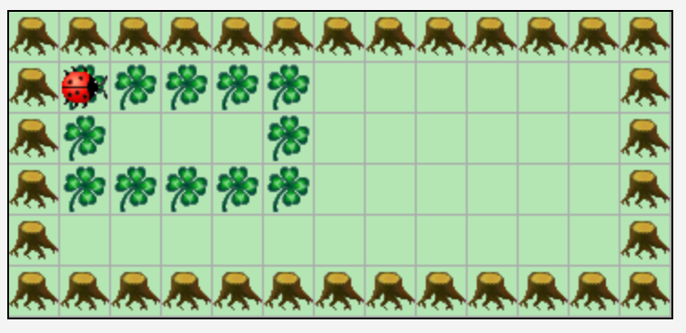

.Ausgangssituation 2 (links) und erwartetes Ergebnis (rechts)
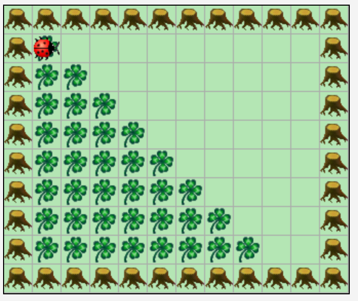
image:images/right-arrow.png[width=10%, pdfwidth=10%]
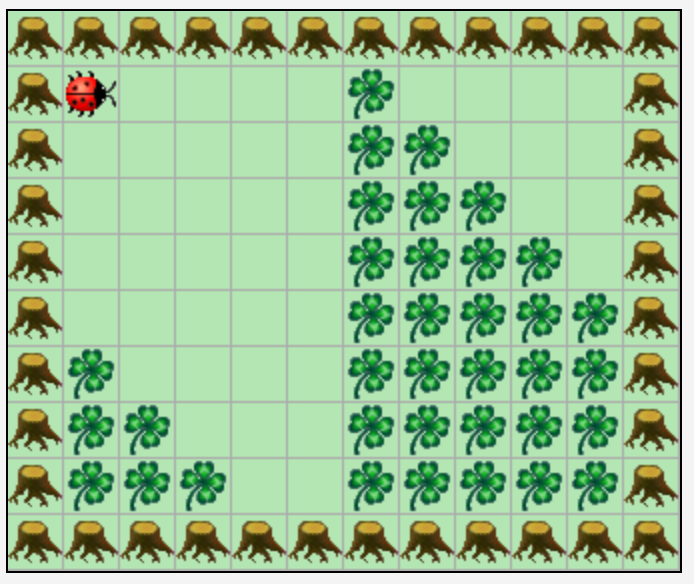

[TIP]
====

Arrays und der Rest-Operator (%) sind zur Lösung hilfreich.

====
